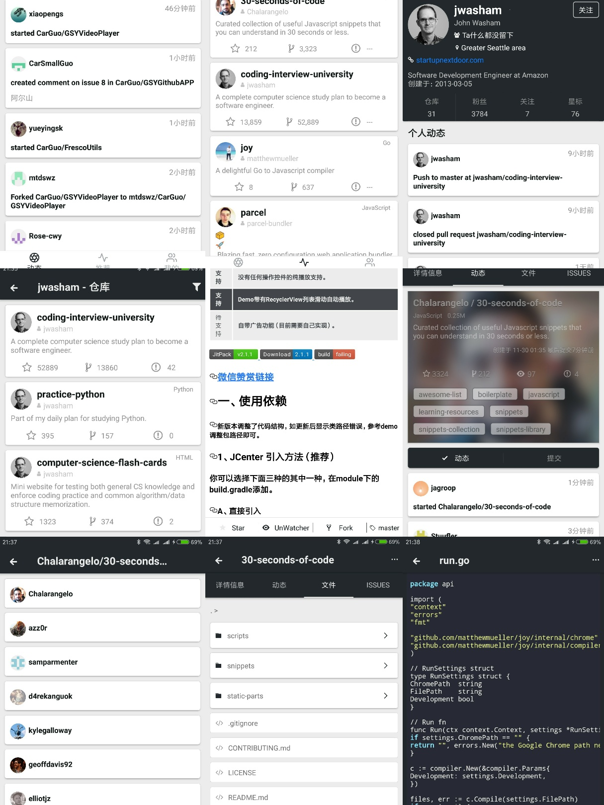
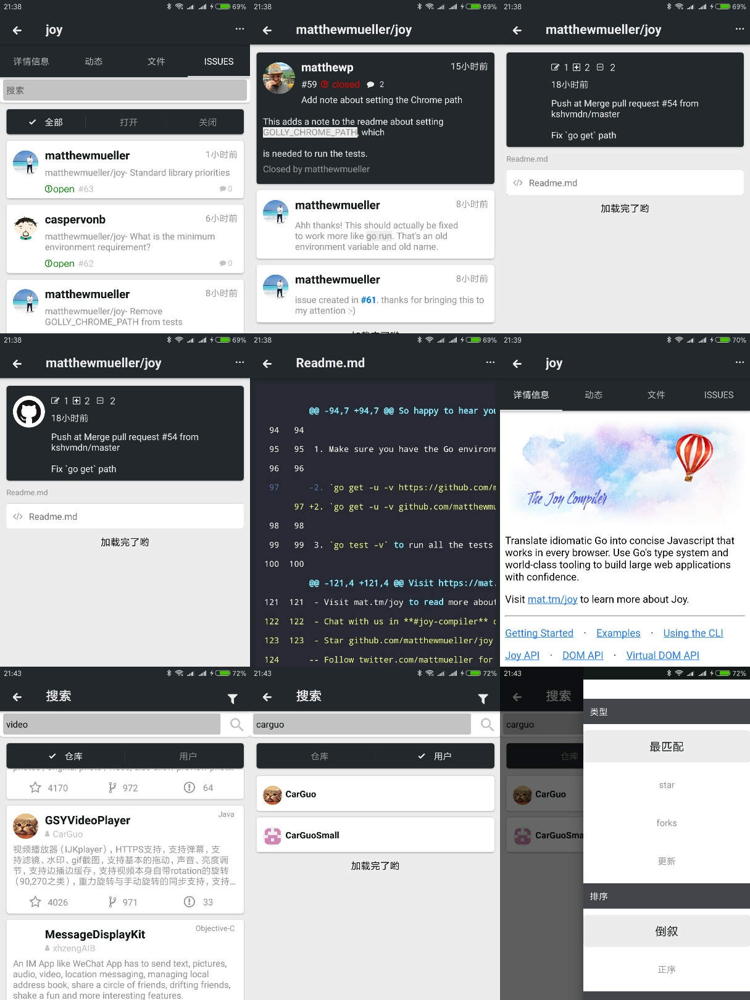
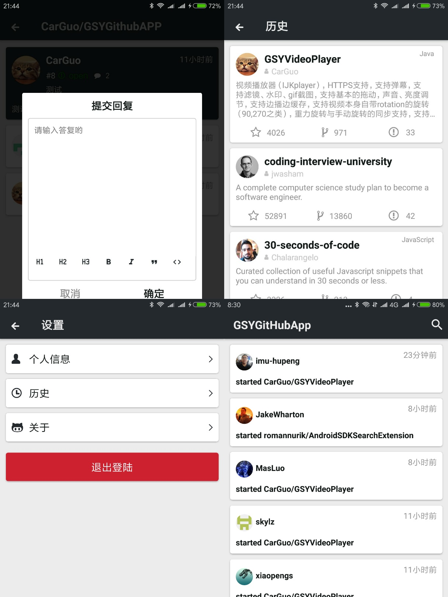

# GSY GitHub App · uni-app 版

> 一款使用 **uni-app（Vue 3 + Vite + TypeScript + Pinia）** 实现的开源 GitHub 跨端客户端，一次构建覆盖 **H5 / 微信小程序 / Android / iOS**。
> 同系列项目 GSY 全家桶之一，UI 与原 Weex 版完全对齐。

[](https://github.com/CarGuo/GSYGithubAppWeex/stargazers)
[](https://github.com/CarGuo/GSYGithubAppWeex/network)
[](https://github.com/CarGuo/GSYGithubAppWeex/issues)
[](./LICENSE)
[](https://uniapp.dcloud.net.cn/)
[](https://vitejs.dev/)

> 注：本仓库历史名为 `GSYGithubAppWeex`（最初基于已归档的 Apache Weex 实现），自 `v2.0.0-uniapp` 起整体迁移到 uni-app。Weex 时代的代码可在 git 历史里追溯，迁移背景与决策见 [MIGRATION.md](./MIGRATION.md)。

---

## 同系列项目

| 技术栈 | 仓库 |
|---|---|
| **uni-app（本仓库）** | https://github.com/CarGuo/GSYGithubAppWeex |
| React Native | https://github.com/CarGuo/GSYGithubAPP |
| Flutter | https://github.com/CarGuo/GSYGithubAppFlutter |
| Android Kotlin（View） | https://github.com/CarGuo/GSYGithubAppKotlin |
| Android Kotlin Compose | https://github.com/CarGuo/GSYGithubAppKotlinCompose |

---

## Features

- **PAT 登录**：使用 GitHub Personal Access Token 登录（GitHub 已废弃 Basic Auth）
- **动态主页**：聚合用户/关注者 events，30 条流式列表，长按事件跳仓库 / 用户
- **Trend 趋势**：接入 GSY 官方 trend API（[guoshuyu.cn](https://guoshuyu.cn/)），daily/weekly/monthly + 10 种语言 chip 切换；三级回退（GSY 到 GitHub Search 到 本地 mock）保证可用
- **多维搜索**：仓库 / 用户 双 tab，本地搜索历史（最多 10 条 + 一键清空）
- **仓库详情**：README / 动态 / 文件 / Issue 4 个 sub-tab + Star/Watch/Fork/Branch 4 个操作；切 tab 不重拉数据
- **代码查看**：generateHtml / generateCode2Html 走 GitHub HTML 渲染 + Dracula 主题，大文件友好
- **Issue 全功能**：评论流（分页 + 下拉刷新）、长按评论弹层（编辑/删除/复制）、关闭/打开/锁定/解锁 issue、回复评论、新建/编辑 issue
- **个人中心**：UserHeadItem 5 列计数（仓库 / followers / following / stars / 主页）+ 跳转
- **设置页**：关于 cell + 退出登录
- **GSY 设计语言**：完整移植原 GSY iconfont（wxcIconFont）+ 主题色 token（`#3c3f41` / `#267aff` / `#ececec`）+ 700/710rpx 卡片体系，UI 与原版逐像素对齐

---

## 截图

> 与原 Weex 版 UI 完全对齐（深主题色 navbar + GSY 卡片 + iconfont）。

| 主页（动态） | 仓库详情 | Issue 详情 |
|:--:|:--:|:--:|
|  |  |  |

---

## Quickstart

### 环境要求

- Node >= 18.20（已校验 20.18.1 可用）
- 推荐 npm（不要混用 pnpm/yarn）

### 安装

```bash
git clone git@github.com:CarGuo/GSYGithubAppWeex.git
cd GSYGithubAppWeex
npm install
```

> `preinstall` 钩子会自动跑 [scripts/check-deps-cooldown.mjs](./scripts/check-deps-cooldown.mjs)，强制所有 pinned 依赖发布满 **15 天**，防御 npm typosquat / supply-chain 攻击。

### 运行

```bash
npm run dev:h5         # 浏览器: http://localhost:8080
npm run dev:mp-weixin  # 微信开发者工具打开 dist/dev/mp-weixin
npm run dev:app        # App 离线打包资源在 dist/dev/app-plus/
```

### 构建

```bash
npm run build:h5
npm run build:mp-weixin
npm run build:app
```

### 登录

1. 打开 https://github.com/settings/tokens 选 Generate new token (classic)
2. 至少勾选 `repo` / `user` / `notifications` scope
3. 在 App 登录页粘贴 PAT 即可

---

## 技术栈

| 层 | 选型 | pinned 版本 |
|---|---|---|
| 跨端框架 | uni-app（vue3） | `3.0.0-5000720260410001` |
| 视图层 | Vue | `3.5.33` |
| 构建 | Vite | `5.2.8` |
| 状态 | Pinia | `3.0.4` |
| 网络 | axios | `1.16.0` |
| i18n | vue-i18n | `9.14.5` |
| UI 组件 | @dcloudio/uni-ui | `1.5.12` |
| 类型系统 | TypeScript | `6.0.3` |

完整依赖清单与版本选型规则见 [package.json](./package.json) 与 [MIGRATION.md § 3](./MIGRATION.md)。

---

## 供应链安全：15 天冷却

为防御 npm typosquat / supply-chain 攻击，本工程**强制要求所有直接依赖的 pinned 版本必须发布满 15 天**：

- 实现：[scripts/check-deps-cooldown.mjs](./scripts/check-deps-cooldown.mjs)
- 触发点：`npm install` 前由 `preinstall` 钩子执行；CI 中 `npm run verify:cooldown`
- 调整窗口：`DEPS_COOLDOWN_DAYS=30 npm install`（仅本地，**生产 / 发版必须 >= 15**）

---

## 项目结构

```
.
├── scripts/check-deps-cooldown.mjs   # 供应链冷却校验
├── docs/
│   ├── legacy-spec.md                # 原 Weex 工程页面/路由/Store 完整文档
│   └── parity-checklist.md           # 新旧 parity 矩阵 + e2e 报告
├── src/
│   ├── api/                          # axios + 端点表 + trending 三级回退
│   ├── components/                   # MainTabBar 等自画 widget
│   ├── config/
│   ├── pages/                        # 15 个页面（welcome / login / main / trend / person / search / setting / repository-detail / user-info / code-detail / issue-detail / edit-issue / common-list / web / dynamic）
│   ├── stores/                       # Pinia
│   ├── styles/                       # GSY 设计 token
│   ├── static/font/                  # wxcIconFont（已从原工程移植）
│   ├── App.vue
│   ├── main.ts
│   ├── manifest.json
│   ├── pages.json
│   └── uni.scss
├── tsconfig.json
├── vite.config.ts                    # 含 GSY trend API 代理
└── package.json
```

---

## 测试与回归

- **类型检查**：`npm run type-check`（vue-tsc，0 报错）
- **E2E**：Playwright 1.59.x 直跑 H5；测试脚本不在仓内，单独放在 `%TEMP%/gsy-e2e/`，确保零 cooldown 污染
- **当前 e2e 矩阵**（14/14 PASS）：login 到 main events 到 repo-detail 4 tab + click + README 不重拉 到 setting logout 到 trend filter/language/list 真实数据 + 切换重发请求

详细矩阵见 [docs/parity-checklist.md](./docs/parity-checklist.md)。

---

## 发布

打 tag 触发 [.github/workflows/release.yml](./.github/workflows/release.yml)：

```bash
# 在 master 上确认无误后
git tag -a v2.x.y -m "release notes"
git push origin v2.x.y
```

最新 GA tag：[`v2.0.0-uniapp`](https://github.com/CarGuo/GSYGithubAppWeex/releases/tag/v2.0.0-uniapp)。

---

## Roadmap

- [x] 15 个页面全量迁移（与原 Weex UI 1:1）
- [x] GSY 官方 trend API + 三级回退
- [x] Playwright H5 e2e
- [x] 15 天供应链冷却
- [ ] vue-i18n 入口接入 + 抽离 hardcode
- [ ] Vitest 单测覆盖 stores / utils
- [ ] iOS 真机验证（Mac 环境）
- [ ] 小程序端 e2e（@dcloudio/uni-automator）

---

## Contributing

欢迎 PR / Issue / Star。提交 PR 前请：

1. `npm run type-check` 0 报错
2. 跑过 H5 dev + 关键路径手测（或 e2e）
3. UI 变更需对齐原 GSY 设计 token，不要引入新视觉语言

---

## License

[MIT](./LICENSE)
